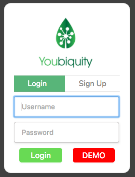
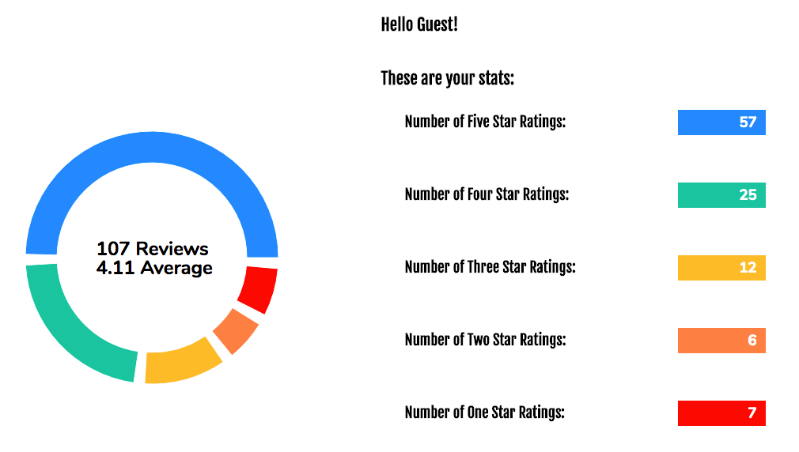

Welcome to Youbiquity!
======================

[Youbiquity live][heroku]
[heroku]: https://youbiquity.herokuapp.com/

Youbiquity is a full-stack web application inspired by Share Grid a consumer-to-consumer photography equipment rental website.

## Features & Implementation
- Users can seamlessly and securely authenticate themselves
- Users can search on multiple and varied properties
	- Average rating of individual listings
	- Location properties using the Google Map API
	- Price range
	- Product Brand(s)
	- Product Category(ies)
- Users can browse and localize listings with the Google Map API
- Users can analyze their average rating performance
- Users can showcase their listings with dedicated listing pages, showcasing a photo gallery
- Users can schedule rentals, taking into account a multitude of scheduling validations
- Users can review the associated rental information on their listings

### Login Modal

### Google Search API and PostgreSQL Querying

### Google Search API and PostgreSQL Querying

### Equipment Listing / Booking Immediately Updates Booking Status

### Users Can Leave Reviews that are Aggregated Immediately

## Technology
It utilizes the following technology:
 - Notable the Frontend (mostly in Javascript & CSS3/HTML5)
	 - React
		 - react-redux, react-router, react-modal, react-addons-css-transition-group, recharts
	 - Google Map API
	 - Cloudinary CDN

 - Notable on the Backend (in Ruby)
	 - Rails
		 - Figaro, JBuilder, Redis
	 - PostgreSQL DB
	 - Hosted on Heroku with custom Domain and Redis allocation

- Version Control
	- Github

## Project Planning
A number of documents were prepared for the implementation of this Project
- [Implmentation Phases](docs/planning_readme.md)
- [API Endpoints](docs/api-endpoints.md)
- [Component Hierarchy](docs/component-hierarchy.md)
- [Sample React State](docs/sample-state.md)
- [DB Schema](docs/schema.md)
- [Wireframes](docs/wireframes)

## Future Directions for the Project

Time allowing, the following features will be implemented:

### Rental Requests

Lessees must request and Lessors may approve rental requests.  With every request and approval/denial an email would be sent to notify using the respective user's email on record.

### Direct Messaging

Users can leave each other messages.  Messages will be automatically marked as read when the recipient opens it.  A worker script may check at the end of every day whether a user has unread messages and notify the user by email.

### Users can schedule pick ups (time/day/location)
Lessors can enter additional information on their listings that will automatically be shared with the lessee when a request is approved.  Using googles calendar API, calendar entries may be sent out.

### Lessors can set rental listing blackout days
Lessors can mark blackout days for their listings to schedule days where equipment may not be requested.

### Customize Rental Agreements
Lessors may configure their rental stipulations using standardized options which will be shown on listings.

### Public Q&A on Rental Listing
Listings may host their own public Q&A board at each listing where prospective lessees can clarify questions and lessors can quickly announce additional information.
