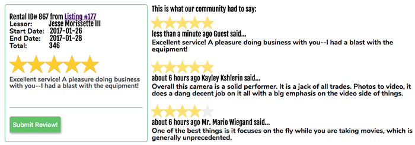

Welcome to Youbiquity!
======================

[Youbiquity live][youbiquity]
[youbiquity]: http://www.youbiquity.io

Youbiquity is a full-stack web application inspired by Share Grid a consumer-to-consumer photography equipment rental website.

## Features & Implementation
- Users can seamlessly and securely authenticate themselves
- Users can search on multiple and varied properties
	- Average rating of individual listings
	- Location properties using the Google Map API
	- Price range
	- Product Brand(s)
	- Product Category(ies)
- Users can browse and localize listings with the Google Map API
- Users can analyze their average rating performance
- Users can showcase their listings with dedicated listing pages, showcasing a photo gallery
- Users can schedule rentals, taking into account a multitude of scheduling validations
- Users can review the associated rental information on their listings

### Login Modal


The use of modals was a very fitting use for the authentication UI/UX experience of the user.

As soon as the AJAX call for the authentication successfully returns, a redirect call through the react router is triggered.

```Javascript
handleSubmit(e){
	e.preventDefault();
	const user = this.state;
	this.props.processForm({user})
		.then(() => this.redirect('search')
	);
}
```

### Google Search API and PostgreSQL Querying

The user is free to choose any combination of up to five different properties of each listing.

The Google Map API allows for boundary filtering of the listing based on their longitutde and lattiude coordinates.  A simple conditional on the querying allows for wrapping around the world.

```Ruby
.where("lat BETWEEN ? AND ?", bounds_filter[:southWest][:lat], bounds_filter[:northEast][:lat])
```

```Ruby
.where("lng > ? OR lng < ?", bounds_filter[:southWest][:lng], bounds_filter[:northEast][:lng])
```

### Equipment Listing / Booking Immediately Updates Booking Status


Overlap of scheduling conflicts are handled on the model layer.

```Ruby
Rental
	.where.not(id: self.id)
	.where(listing: listing)
	.where(<<-SQL, start_date: start_date, end_date: end_date)
		NOT( (start_date >= :end_date) OR (end_date <= :start_date) )
	SQL
```

The user receives seamless visual confirmation through the use of Reacts Transition Group.  Instead of blinking into view, the element added to the virtual DOM eases into place.

```Javascript
<ReactCSSTransitionGroup
	transitionName="example"
	transitionAppear={true}
	transitionAppearTimeout={1000}
	transitionEnterTimeout={1000}
	transitionLeaveTimeout={600}>
	{ this.rentalDates() }
</ReactCSSTransitionGroup>
```

### User Profile


The user's rating performance is visualized through the Rechart module.  Maping through relevant user Key Performance Indicators makes the user's performance visually apparent.

```Javascript
<PieChart width={500} height={500} onMouseEnter={this.onPieEnter}>
	<Pie
		data={data}
		cx={250}
		cy={250}
		innerRadius={120}
		outerRadius={160}
		fill="#8884d8"
		paddingAngle={5} >
		{
			data.map((entry, index) => <Cell key={index} fill={COLORS[index % COLORS.length]}/>)
		}
	</Pie>
</PieChart>
```

The user performance is mostly done in the user model through a number of aggregations.

In order to dry out the code for counting reviews by rating score, we pass a 'rating' argument into the model method below.

```Ruby
def average_listing_rating
	(self.total_ratings_received / self.review_count_received.to_f).round(2)
end

def total_ratings_received
	self.listings.inject(0) do |acc, listing|
		acc + listing.reviews.inject(0) do |acc2, review|
			acc2 + review.review
		end
	end
end

def review_count_received
	self.listings.inject(0) { |acc, listing| acc + listing.review_count }
end

def review_count_by_rating(rating)
	total = 0
	self.listings.each do |listing|
		listing.reviews.each do |review|
			total += 1 if review.review == rating
		end
	end
	total
end
```

### Users Can Leave Reviews that are Aggregated Immediately


User data is collected through visual rating form components.

Each individual rating form has their own internal state for error handling.

```Javascript
handleSubmit(){
	this.props.submitReview({review: this.state})
		.fail((errors) => this.setState({errors: errors.responseJSON}));
}

<div>
	<b className="grey">Enter star rating below here...</b>
	<Rating defaultValue={null}
		className="rating-filter"
		onUpdate={this.logRating}>
	</Rating>
	<TextInput style={
			{ minHeight: 80, "overflow-y": "auto", "border": "1px solid #a9a9ac", "padding": "10px", "padding-top": "0" }
		} onChange={this.logReview} placeholder="Enter review in here..." allowNewLine/>
	<button className="review" onClick={this.handleSubmit}>Submit Review!</button>
	{ this.renderErrors() }
</div>
```

## Technology
It utilizes the following technology:
 - Notables in the Frontend (mostly using Javascript & CSS3/HTML5)
	 - React
		 - react-redux, react-router, react-modal, redux, react-addons-css-transition-group, recharts
	 - babel, lodash, recharts, rc-slider, belle
	 - Google Map API
	 - Cloudinary CDN

 - Notables in the Backend (Ruby)
	 - Rails
		 - Figaro, JBuilder, Redis
	 - PostgreSQL DB
	 - Hosted on Heroku with custom Domain and Redis allocation

- Version Control
	- Github

## Project Planning
A number of documents were prepared for the implementation of this Project
- [implementation Phases](docs/planning_readme.md)
- [API Endpoints](docs/api-endpoints.md)
- [Component Hierarchy](docs/component-hierarchy.md)
- [Sample React State](docs/sample-state.md)
- [DB Schema](docs/schema.md)
- [Wireframes](docs/wireframes)

## Future Directions for the Project

Time allowing, the following features will be implemented:

### Rental Requests

Lessees must request and Lessors may approve rental requests.  With every request and approval/denial an email would be sent to notify using the respective user's email on record.

### Direct Messaging

Users can leave each other messages.  Messages will be automatically marked as read when the recipient opens it.  A worker script may check at the end of every day whether a user has unread messages and notify the user by email.

### Users can schedule pick ups (time/day/location)
Lessors can enter additional information on their listings that will automatically be shared with the lessee when a request is approved.  Using googles calendar API, calendar entries may be sent out.

### Lessors can set rental listing blackout days
Lessors can mark blackout days for their listings to schedule days where equipment may not be requested.

### Customize Rental Agreements
Lessors may configure their rental stipulations using standardized options which will be shown on listings.

### Public Q&A on Rental Listing
Listings may host their own public Q&A board at each listing where prospective lessees can clarify questions and lessors can quickly announce additional information.
