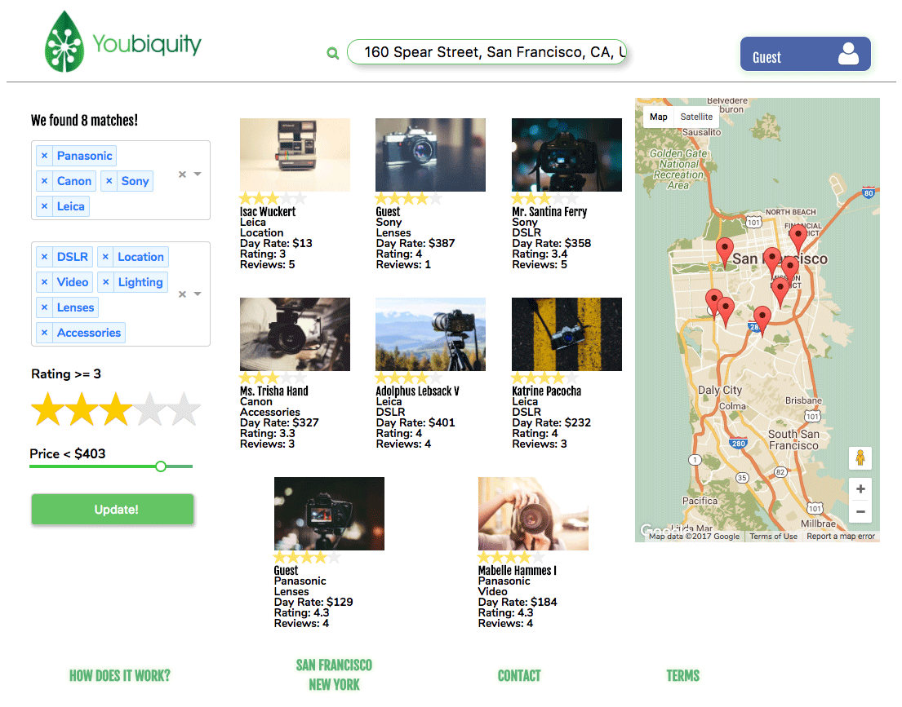
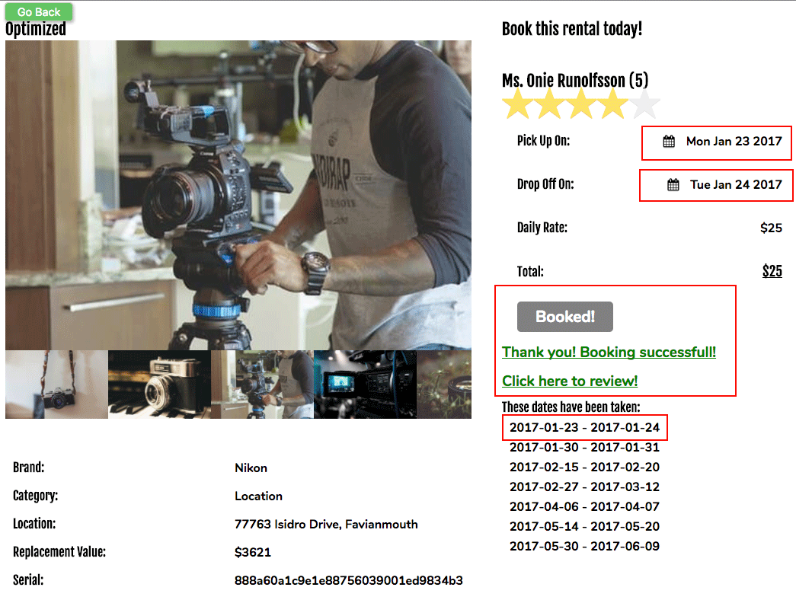

Welcome to Youbiquity!
======================

[Youbiquity live][heroku]
[heroku]: https://youbiquity.herokuapp.com/

Youbiquity is a full-stack web application inspired by Share Grid a consumer-to-consumer photography equipment rental website.  

It utilizes the following technology:

 - Notable the Frontend (mostly in Javascript & CSS3/HTML5)
	 - React
		 - react-redux
		 - react-router
		 - react-modal
		 - react-addons-css-transition-group
		 - recharts
	 - Google Map API
	 - Cloudinary CDN

 - Notable on the Backend (in Ruby)
	 - Rails
		 - Figaro
		 - JBuilder
		 - Redis
	 - PostgreSQL  DB
	 - Hosted on Heroku with custom Domain

- Version Control
	- Github

## Features & Implementation
- Users can seamlessly and securely authenticate themselves
- Users can search on multiple and varied properties
	- Average rating of individual listings
	- Location properties using the Google Map API
	- Price range
	- Product Brand(s)
	- Product Category(ies)
- Users can browse and localize listings with the Google Map API
- Users can analyze their average rating performance
- Users can showcase their listings with dedicated listing pages, showcasing a photo gallery
- Users can schedule rentals, taking into account a multitude of scheduling validations
- Users can review the associated rental information on their listings

### Schema
In its base implementation, Youbiquity will have 6 tables:
 - **User** (Both Lessee and Lessor)
	 - This table will be shared by lessees and lessors to store `username`, `session tokens`, and `password digest` information
	 - It will be referenced by **Listing** and **Rental**
 - **Listing** (Equipment Listing)
	 - This table will house the bulk of the websites data with foreign keys to **User**, **Brand**, and **Category**
	 - It will allow for storing valid location strings that can validly be queried by the google maps API along with their respective `lat` (latitude) and `lng` (longitude) coordinates.
		 - This information will be used to mark a good map API implementation to give users visual reference on the location of **Listings**.
 - **Rental** (Actual Rental Request)
	 - This table stores foreign keys for and references to **Listing** and **User** (lessee)
	 - In addition, it will be used to store the beginning and end date of a "rental."
	 - By virtue of active records' through association, **Listings** will have reference to lessor as well.
 - **Brand** (Equipment Brand)
	 - Stores "brands" and is referenced by **Listing**
 - **Category** (Category)
	 - "Stores" categories and is referenced by **Listing**
 - **Photo** (Listing Photos)
	 - The project will use a CDN services to store and manipulate images
	 - As such, it will store reference to the **Listing** and a `cdn_url`
 - **Review** (Reviews both Lessors and Lessees)
	 - Lessors and Lessees have the option to leave each other a review for each completed "rental" both quantitatively (a star rating) and qualitatively (a note).

## Future Directions for the Project

Time allowing, the following features will be implemented:

### Rental Requests

Lessees must request and Lessors may approve rental requests.  With every request and approval/denial an email would be sent to notify using the respective user's email on record.

### Direct Messaging

Users can leave each other messages.  Messages will be automatically marked as read when the recipient opens it.  A worker script may check at the end of every day whether a user has unread messages and notify the user by email.

### Users can schedule pick ups (time/day/location)
Lessors can enter additional information on their listings that will automatically be shared with the lessee when a request is approved.  Using googles calendar API, calendar entries may be sent out.

### Lessors can set rental listing blackout days
Lessors can mark blackout days for their listings to schedule days where equipment may not be requested.

### Customize Rental Agreements
Lessors may configure their rental stipulations using standardized options which will be shown on listings.

### Public Q&A on Rental Listing
Listings may host their own public Q&A board at each listing where prospective lessees can clarify questions and lessors can quickly announce additional information.
